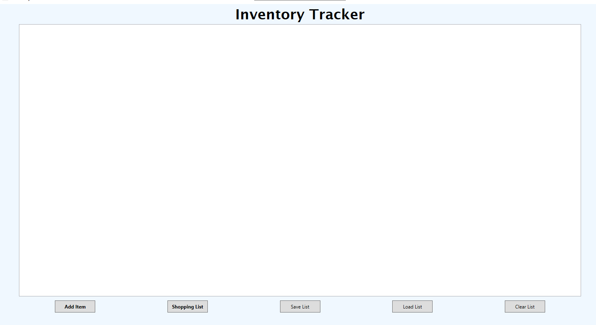
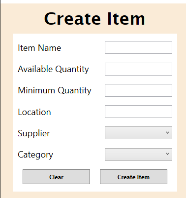
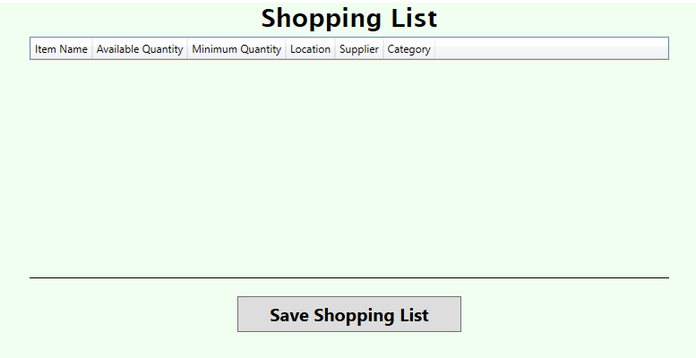

# InventoryTracker
Made in collaboration with Samuel Dessureault.

## Main Concept
This WPF application was made for an assignment with a goal of creating an app with a simple interface that can manage an inventory.

The home page of the application consists of a list which holds information of all inventory items.

The user can save the list to a local file the same way they can load the list from a local file into the app.

The user can add inventory items with just a few clicks.

Finally the user can access a Shopping List, which is another list with inventory items that have an available quantity smaller than the minimum quantity, which means the item needs to be reflled. The shopping list can also b saved to a local file.

